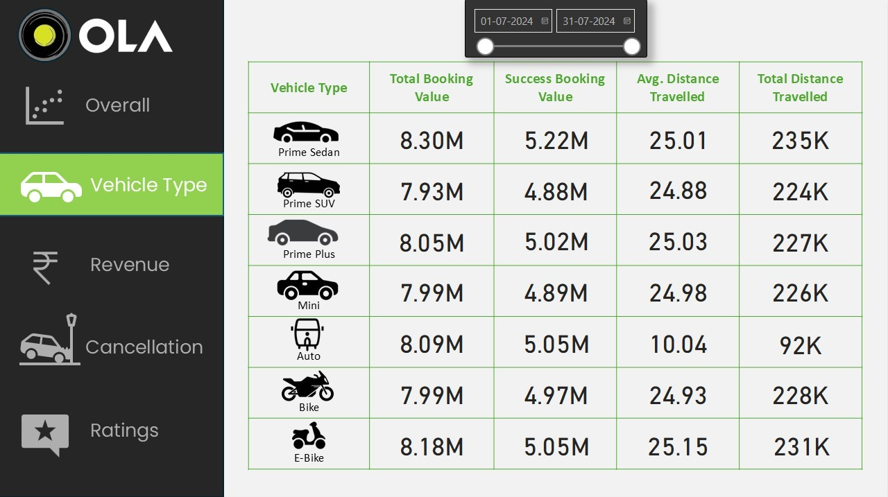
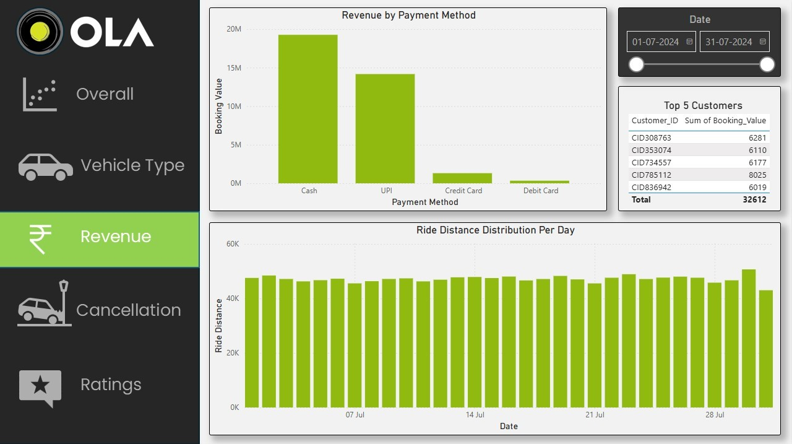
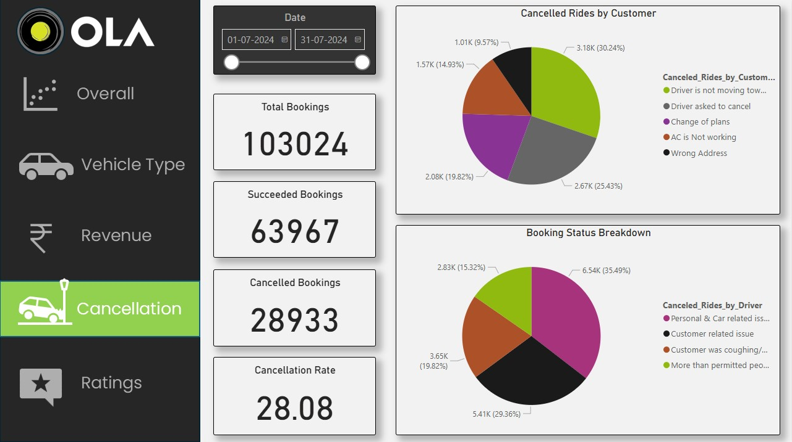
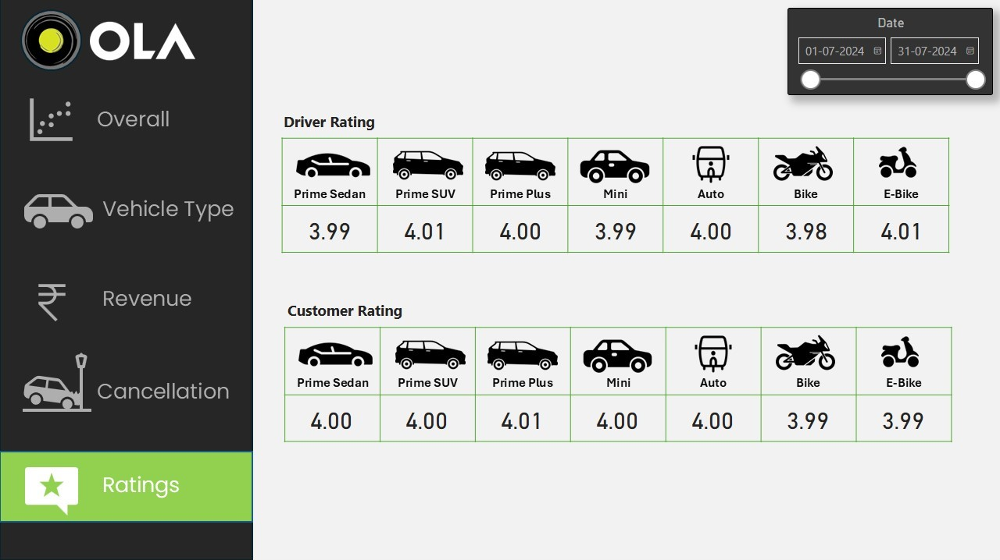
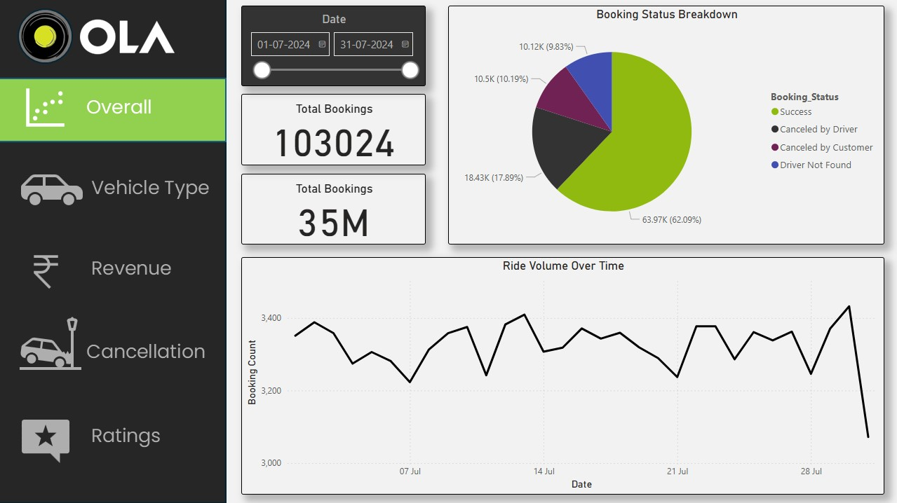

# 🚕 OLA Data Analytics Project

A comprehensive data analytics project based on 1 Lakh+ rows of **cleaned OLA cab booking data**. This project uses:

- **SQL** for querying and insights generation  
- **Power BI** for building interactive dashboards  
- **Excel** for initial exploration only (not cleaning)

The objective was to solve business problems and make actionable recommendations for operational and customer-related improvements.

---

## 🔧 Tools Used

- **SQL** – Core tool for querying, aggregations, and building views  
- **Power BI** – Designed 5 rich dashboards for visual insights  
- **Excel** – Used for exploring patterns before dashboarding

---

## 📁 Files Included

- `OLA_Booking_Data.xlsx` – Final cleaned dataset (1,00,000+ rows)  
- `SQL_Queries.sql` – All SQL queries and business logic  
- `Dashboard.pbix` – Power BI file for all visualizations  
- `screenshots/` – Folder containing 5 key dashboard screenshots  
- `Insights_QnA_Recommendations.pdf` – Business questions, SQL answers, and recommendations  
- `README.md` – This project documentation

---

## ❓ Business Questions Answered

Examples of business questions solved in the project:

- Total successful rides?  
- Average distance per vehicle type?  
- Number and reasons for ride cancellations?  
- Most used payment methods?  
- Rating patterns by vehicle type?

👉 Full list of questions, answers, and exact SQL queries included in `Insights_QnA_Recommendations.pdf`.

---

## 📊 Dashboard Overview (Power BI)

Five dashboards were created in Power BI to visually analyze the cleaned data:

1. **Vehicle Type Insights** – Total rides, average distance, and preferences  
2. **Revenue Overview** – Revenue distribution and average earnings  
3. **Cancellation Analysis** – Causes of ride failures by drivers/customers  
4. **Ratings Analysis** – Customer and driver feedback patterns  
5. **Overall Summary** – Combined KPIs and trends in one view

### Sample Visuals

  
  
  
  

---

## 📈 Key Insights

- **Sedan and Prime** vehicles are used more and cover longer average distances  
- **Driver-side cancellations** due to personal or car issues are high  
- **UPI** is the most common payment method  
- **Customer ratings** fluctuate significantly across vehicle types  
- **High revenue** is associated with longer distances and premium cars

---

## 💡 Final Business Recommendations

1. **Reduce Driver Cancellations**  
   Implement real-time driver reassignment and penalties for frequent cancellations.

2. **Optimize Vehicle Type Availability**  
   Increase availability of Sedans and Primes in profitable, high-demand areas.

3. **Apply Data-Driven Dynamic Pricing**  
   Use dynamic pricing during peak times or in ride-heavy zones to increase revenue.

4. **Improve Customer Satisfaction Tracking**  
   Leverage customer rating data to address low-rated vehicles/routes and implement service improvements.

✅ All recommendations and explanations are documented in `Insights_QnA_Recommendations.pdf`.

---

